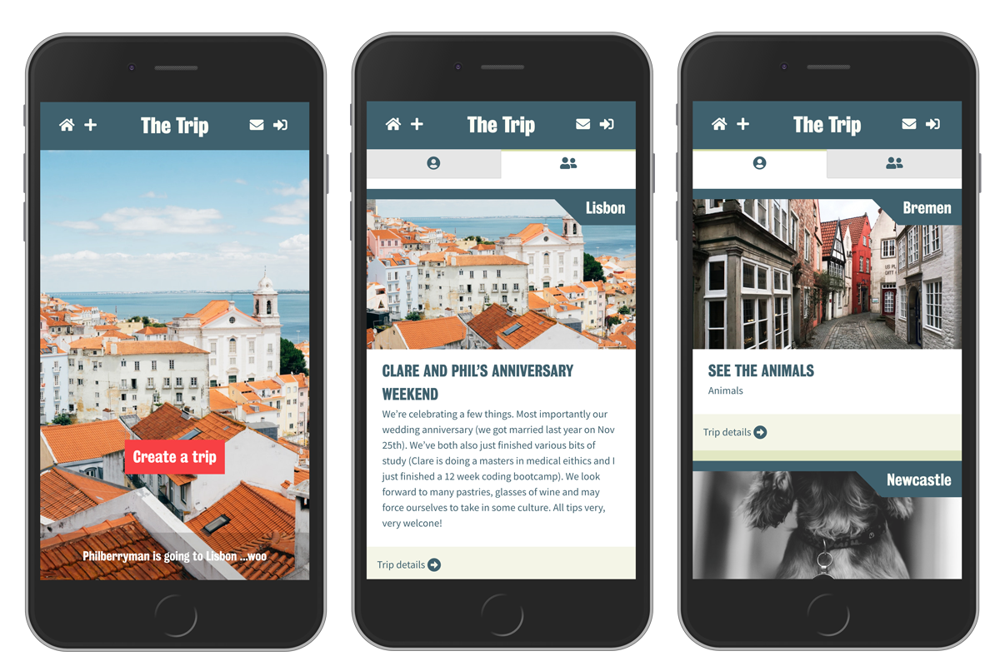

# The Trip

### A platform to help you plan a successful and enjoyable holiday. Crowdsource your trip by inviting suggestions from the people who know you best: your friends.

> View live demo **[TheTrip.io](https://www.thetrip.io/)**

####Planning

**[TheTrip.io](https://www.thetrip.io/)** provides a user-friendly platform for the trip planner to create a trip, then share a link to a unique trip page with those going, where trip-goers can plan:
=======
# The-Trip

## What is it?

TheTrip.io is a platform to help you plan a successful and enjoyable holiday. There are 3 main areas it helps you plan :

1. Flights - currently a flight search engine using the kiwi.com API
2. Hotels - hotel search using Google Places API
3. Places - a wider search using Google Places API

Search results may be scrapbooked and enable users to pin down the exact where, how and when; when they go away they trip planners have everything to hand, stored on their trip page.

####Crowdsourcing

A key feature of The Trip is that it enables users to crowdsource suggestions from friends.
By sharing an invite URL you can ask for ideas about where to go when arriving at the trip destination. Friends can recommend venues, museums, sights etc, upvote and comment on each other’s suggestions. Planners may select favourites from suggestions to prioritise for their visit.

These suggestions are more valuable than rankings found on sites such as Tripadvisor, which often miss the mark – rather, who better to ask than people who know you, who know the kinds of places you would like to visit.

**[TheTrip.io](https://www.thetrip.io/)** provides a sharing platform for those who love travel, where multiple trips - your own and those of your friends - may be viewed, added to, discussed.

---

### Installation & setup

- Clone this repo and run `npm install` to download the dependencies.
- Create a local PostgreSQL database and run the query in the `database.sql` file to set up the tables.
- Create a `.env` file at the root level of the app folder and add the following variables:

```
DB_HOST=localhost
DB_NAME=
DB_USERNAME=
DB_PASSWORD=
GOOGLE_API=
UNSPLASH_API=
```

API Keys needed:

- Google Places
- Kiwi
- Unsplash

Run `npm start` to launch the app and navigate to localhost:8080

---

### Tech stack

#### Front end

- React
- Redux
- React-Router
- SCSS
- Plus&hellip; PG promise, cookie parser, moment, datepicker, airport codes, React hooks

#### Back end

- Express
- Node.js
- PostgreSQL
- Passport &amp; BCrypt
- Web sockets

#### Dev tools

- ES Lint &amp; Prettier
- Jest

---

### Features

#### Login &amp; invites

- Unique, memorable shareable trip links, with permission code variables, are dynamically generated from trip data.
- Persistent log-in with session cookies: once logged in a user can easily jump to their trip or into the suggestions discussion.
- Authorisation and authentication - Passport with BCrypt

#### Views &amp; routes - React-Router

- Trip views are managed by login state and permission ('trip owner' or 'suggester'), served by url endpoint (React-Router).

#### API data management

- APIs: _Google Places_ and _Kiwi_ fetch live dynamic data to populate suggestions for venues and hotels and to drive flight search. _Unsplash_ fetch to generate images for each trip based on location query.

#### Crowdsource engine

- Suggestions managed and ranked by likes or chronology, with filter for trip favourites.

#### Design

- Figma wireframes and design patterns

#### Database

- Trips, customers (users), permissions, suggestions, comments and flights are held in a relational database.

---

### Contributors &amp; development focus

**[Phil Berryman](https://github.com/philberryman)**
- Server work - API endpoints, queries in Postgres, Heroku setup
- Register / Login - using passport.js and React Router

**[Chris Phillers](https://github.com/chrisphillers)**
Blah blah blah content to come

**[Melanie Ashby](https://github.com/lemonydesign)**
Create &amp; seed initial database, semantic-bem html schema, component creation and hierarchy, SASS &amp; design, user journey mapping using React-Router links &amp; views

**[Tom Bast](https://github.com/tomjbast)**
Flights and unit tests

---

### In progress

- Suggestions ranking, manage and deploy css classes to visually toggle onClick events.
- Live update with web sockets. Each new trip edit, suggestion, comment, like or favourite triggers an update for all participants so they always see the most up-to-date info.
- Site footer
- Page animation wrapped and deploy Pose animation library to make 'appy'
- Flights search refinements

---

### Future plans

- Automated share functionality for invite urls
- Booking for flights and hotels.
- Integration with GoogleMaps API
- Desktop layout.
- Cross-browser testing (currently only Chrome).
- Further unit testing
